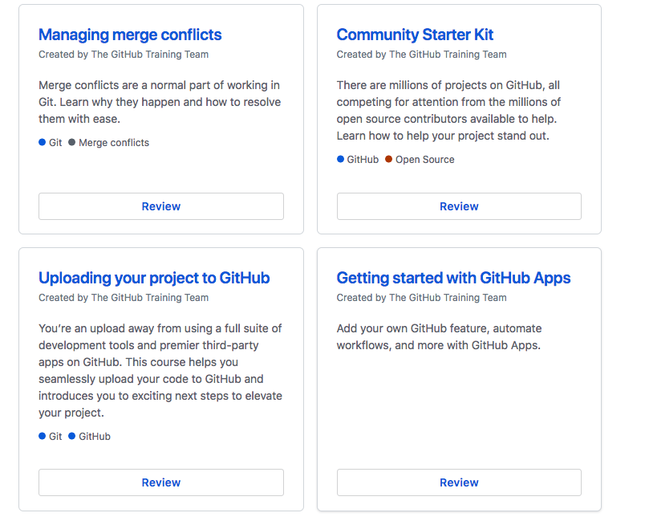
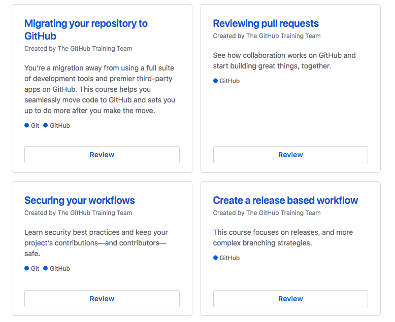
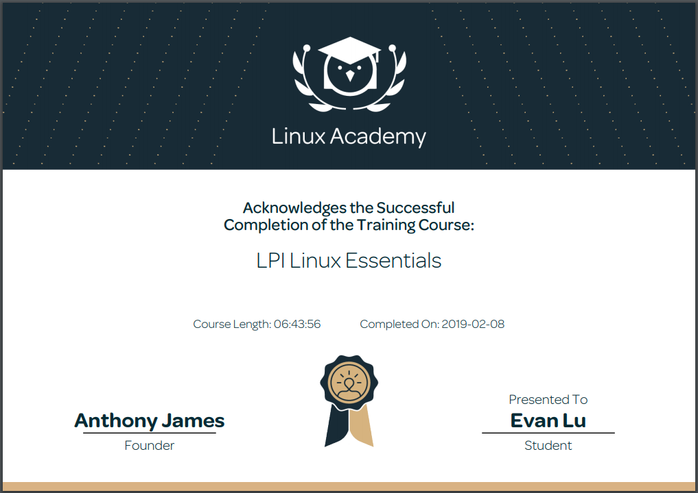

<h1> Technical Skills and Certifications </h1>

<h2> Technical Skills </h2>
  

GITHUB

<h3> Description: </h3>
I completed the introductory GitHub learning labs offered on the GitHub website:
https://lab.github.com/courses 
  
  <ul>
  The 12 GitHub labs include an overview of fundamental GitHub skills including:
  <li>Introduction to Github</li>
  <li>Communicating using Markdown</li>
  <li>Introduction to HTML</li>
  <li>GitHub Pages</li>
  <li>Managing merge conflicts</li>
  <li>Community Starter Kit</li>
  <li>Uploading your project to Github</li>
  <li>Gettting started with GitHub Apps</li>
  <li>Migrating your repository to GitHub</li>
  <li>Reviewing pull requests</li>
  <li>Securing your workflows</li>
  <li>Create a release based workflow</li>
  </ul>
  
<h4> Course Completion: </h4>
  
  
  
  
  
  </detail>

 
 
  <detail>
Linux Essentials 

<h5> Description: </h5>
  I completed the LPI Linux Essentals offed at https://linuxacademy.com
  <ul>
    The LPI Linux Essentials include an overview of skills including:
    <li>How to Acesss an Linux Installation</li>
    <li>Major Open Source Applcations </li>
    <li>Understanding Open Source Software and Licensing</li>
    <li>ICT Skills and Working in Linux</li>
    <li>Command Line Basics</li>
    <li>Using the Command Line to Get Help</li>
    <li>Using Directories and Listing Files</li>
    <li>Creating, Moving and Deleting Files</li>
    <li>Archiving Files on the Command Line</li>
    <li>Searching Files on the Command Line</li>
    <li>Turning Commands into a Script</li>
    <li>Choosing an Operating System</li>
    <li>Where Data is Stored</li>
    <li>Basic Security and Identifying User Types</li>
    <li>Creating Users and Groups</li>
    <li>Managing File Permissions and Ownership</li>
    <li>Special Directories and Files</li>
    
  <h6> Course Completion: </h6>
  
  </detail>
 
  
<detail>
Analyzing and Visualizing Data with Power BI

<h1> Description: </h1>
    I completed the Analyzing and Visualizing Data with Power BI offed at https://courses.edx.org/courses/course-v1:Microsoft+DAT207x+1T2019/course/
  <ul>
    Analyzing and Visualizing Data with Power BI include an overview of skills including:
    <li>Data Transformations</li>
    <li>Desktop Modelling</li>
    <li>Desktop Visualization</li>
    <li>Power BI Service</li>
    <li>Working with Excel</li>
    <li>Direct Connectivity</li>
    <li>Developer API</li>
    <li>Moblie App</li>
  
  <h1> Course Completion: </h1>
  
    
   
  
  
  
  
  
  
  
  </detail>

    
    
    
    
    

  
