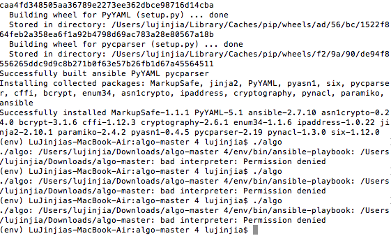

<h1> Technical Skills and Certifications </h1>

<h2> Technical Skills </h2>
  

GITHUB

<h3> Description: </h3>
I completed the introductory GitHub learning labs offered on the GitHub website:
https://lab.github.com/courses. These courses taught me how to create a repository, create and pull request, upload documents, etc. 
   
   
  
  <ul>
  The 12 GitHub labs include an overview of fundamental GitHub skills including:
  <li>Introduction to Github</li>
  <li>Communicating using Markdown</li>
  <li>Introduction to HTML</li>
  <li>GitHub Pages</li>
  <li>Managing merge conflicts</li>
  <li>Community Starter Kit</li>
  <li>Uploading your project to Github</li>
  <li>Gettting started with GitHub Apps</li>
  <li>Migrating your repository to GitHub</li>
  <li>Reviewing pull requests</li>
  <li>Securing your workflows</li>
  <li>Create a release based workflow</li>
  </ul>
  
<h4> Course Completion: </h4>
  
  
  
  
  
 

 
  
 
  

Linux Essentials 

<h3> Description: </h3>
  I completed the LPI Linux Essentals offed at https://linuxacademy.com. These courses taught me the basics of command lines, the linix kernal and the operating system as a whole. 
   
   
  
  <ul>
    The LPI Linix Essentials include an overview of skills including:
    <li>How to Acesss an Linux Installation</li>
    <li>Major Open Source Applcations </li>
    <li>Understanding Open Source Software and Licensing</li>
    <li>ICT Skills and Working in Linux</li>
    <li>Command Line Basics</li>
    <li>Using the Command Line to Get Help</li>
    <li>Using Directories and Listing Files</li>
    <li>Creating, Moving and Deleting Files</li>
    <li>Archiving Files on the Command Line</li>
    <li>Searching Files on the Command Line</li>
    <li>Turning Commands into a Script</li>
    <li>Choosing an Operating System</li>
    <li>Where Data is Stored</li>
    <li>Basic Security and Identifying User Types</li>
    <li>Creating Users and Groups</li>
    <li>Managing File Permissions and Ownership</li>
    <li>Special Directories and Files</li>
    </ul>
    
  <h4> Course Completion: </h4>
  
  
  

   
 
  
  

Analyzing and Visualizing Data with Power BI

  <h3> Description: </h3>
    I completed the Analyzing and Visualizing Data with Power BI offed at https://courses.edx.org/courses/course-v1:Microsoft+DAT207x+1T2019/course/. These courses taught me how to add and change elements on the dashboard. 
   
   
  <ul>
    Analyzing and Visualizing Data with Power BI include an overview of skills including:
    <li>Data Transformations</li>
    <li>Desktop Modelling</li>
    <li>Desktop Visualization</li>
    <li>Power BI Service</li>
    <li>Working with Excel</li>
    <li>Direct Connectivity</li>
    <li>Developer API</li>
    <li>Moblie App</li>
  </ul>
  
  <h4> Course Completion: </h4>
  
  
    
  
   
  
  
  
  
  
  
  
  
  
  
  
  
  
  
  

   
   
   

AWS Essentials 

<h3> Description: </h3>
  I completed the AWS Essentials offed at https://linuxacademy.com. These courses provided me skills in AWS such as Elatic cloud compute, storage and database services, ect. 
   
   
  <ul>
    The AWS Essentials include an overview of skills including:
    <li>Account Basics </li>
    <li>Idntity and Access Management(IAM) </li>
    <li>Networking Services and Connectivity</li>
    <li>Compute Services</li>
    <li>Elastic Cloud Compute (EC2)</li>
    <li>Storage Services </li>
    <li>Database Services</li>
    <li>Load Balancing, Elasticity and Scalability</li>
    <li>Serverless Compute</li>
    </ul>
    
  <h4> Course Completion: </h4>
  
  
  

   
  
   

PowerBi Dashboard

 <h3> Youtube video: </h3>
  From the skills that I have optained from "Analyzing and Visualizing Data with Power BI". I create a dashboard from a dataset provided by microsoft to showcase my interpretation of it. 
   
   
 
  <a href="https://www.youtube.com/watch?v=kfMNq6R3-cE&feature=youtu.be">https://www.youtube.com/watch?v=kfMNq6R3-cE&feature=youtu.be</a>
    
  <h4> Dashboard Pictures: </h4>
  
  
  
  
  

   
 
  
  

Failed VPN

  <h3> Description: </h3>
    Attempted to create my own VPN using the instruction at https://github.com/trailofbits/algo. However failed during step 5 of the 6 step process of setting up. Below is a picture of the problem during step 5.  
   
   
  
  
  <h4> VPN termial Picture: </h4>
  
  </detail>
   
    
    

  
  
